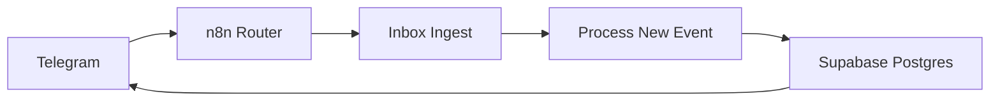

# Market Screener

Market Screener — Telegram bot for crypto/X threat intel with immediate risk alerts + daily digest.

**Demo In 30 Seconds**
1. Open Telegram bot -> `/start <token>`
2. Send a post text
3. If risk -> 🚨 immediate alert
4. `/digest` -> curated summary with evidence

**What It Does**
- Ingest (Telegram) -> normalize/dedup -> store in Postgres
- LLM classification (strict JSON validation, retries)
- Risk gating: alert only for `RISK_FUD`
- Digest: evidence-only items, quotas by category

**Architecture**

**Data Model (Minimal)**
- `intel_events`
- `alerts_sent`
- `kb_chunks` (if used)
- `digests` (if used)

**Security & Safety**
- Secrets only in n8n credentials/env
- Supabase: no anon access (RLS + revoked grants)
- Dedup alerts to prevent spam
- Scraping disabled; text-only input

**Run Locally (Optional)**
This repo contains workflow JSON + schema SQL; deployment uses n8n Cloud + Supabase.

**Roadmap**
- Per-user preferences
- Richer entity extraction
- Multi-source feeds
